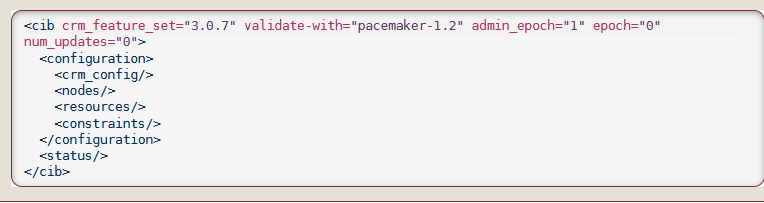

# Projecte Pacemaker edt 2020/2021


# Índex

- **[Objectius del projecte](#Objectius-del-projecte)**
- **[Que és Pacemaker?](#Que-és-Pacemaker?)**
- **[Que és un clúster?](#Que-és-un-clúster?)**
  - **[Components](#Components)**
    - **[Cluster Information Base](#Cluster-information-base)**
    - **[Cluster Resource Manager Daemon](#Cluster-Resource-Manager-Daemon)**
    - **[Shoot the Other Node in the Head (STONITH)](#Shoot-the-Other-Node-in-the-Head (STONITH))**
  - **[Quorum](#Quorum)**
  - **[Corosync](#Corosync)**
  - **[DRBD](#DRBD)**
  - **[Tipus de clúster](##Tipus-de-cluster)**
    - **[Clúster Active/Passive](#Cluster-active-passive)**
    - **[Clúster Active/Active](#Cluster-Active/Active)**

## Objectius del projecte
L'objectiu és conéixer les funcionalitats de Pacemaker i d'altres tipus de software amb els que funciona conjuntament, per a dotar d'*Alta disponibilitat* a un clúster. Per demostrar el seu funcionament, aquest clúster estarà format per 2 nodes, i funcionarà com a un servidor que ofereix servei d'HTTP.

[Procediment de creació d'un clúster](Procediment_Practica/Cluster_Creation.md)

[Procediment d'aplicació de DRBD a un clúster](Procediment_Practica/Cluster_DRDB.md)

## Que és Pacemaker ?
Pacemaker és un tipus de software de control de recursos de clúster, que s'utilitza generalment per preservar la integritat de les dades i poder proporcionar un servei amb el mínim d'aturades possible. 
Algunes de les característiques i funcionalitats que pot atorgar al conjunt de hosts són: 

- Administració de la configuració de la infraestructura
- Replicació de dades en els diferents nodes
- Protecció de les dades en cas de la caiguda d'algún node (redundància)
- Emmagatzemament compartit
- Actualització automàtica de les dades desde qualsevol dels nodes
- Generar condicions per al funcionament dels serveis que ofereix el clúster
    - Col·locació del servei a un node en concret (o que no s'engegi mai a )
    - Serveis que només s'engegen si ja hi ha un altre actiu
    - Ordre d'engegada dels serveis


## Que és un clúster?
Un **clúster** es un conjunt de nodes que funciona amb l'objectiu de portar a terme una o varies tasques com si fóssin un únic ordinador. Pot tenir diverses funcions, tals com:

- **Alt rendiment:** els diferents nodes poden treballar paral·lelament per a reduir el temps d'execució dels serveis i millorar el rendiment global del sistema.
- **Emmagatzemament:** permet allotjar tot el conjunt de dades als diferents nodes, el que ofereix la possibilitat de accedir a les dades del servidor a través de qualsevol dels ordinadors que composen el clúster. Aquesta característica la proporciona GFS2, conjuntament amb Pacemaker.
- **Balanç de càrregues:**: distribueix les sol·licituds que provenen de la xarxa entre els diferents nodes, per a que no hi hagi una sobrecàrrega en un d'aquests. Es redirigeixen les ordres a un altre node en cas de que algún quedi inoperatiu.
- **Alta disponibilitat:** proporciona un servei sense aturades en cas de que algún element del sistema caigués o fallés. 
Un cop detectat un error de hardware o de software, s'engega automàticament la mateixa aplicació o servei a un altre sistema/node sense necessitat de fer-ho manualment. Aquest procés es conegut com *failover*, que es tradueix com a *migració a causa d'error*. 

Aquests clústers, a l'hora de muntar-los, s'utilitzará la comanda de shell **pcs**, que permet configurar a la vegada Pacemaker i Corosync, sol·lucionant internament totes les dependencies i característiques individuals entre aquests tipus de software. A versions més antigues de diferents sistemes operatius, calia configurar els dos components de formar separada, el que feia el procés molt més difícil i llarg.

### Components
#### Cluster Information Base (CIB)



És un dimoni que utilitza XML internament que té la funció de distribuir i sincronitzar la configuració actual, i l'estat del *Designated Coordinator*(DC) - node assignat per Pacemaker per a detectar i distribuir l'estat del clúster - a tots els nodes.
Al CiB es desen certes configuracions essencials per al funcionament de l'estructura. 

- **Configuration**: conté informació sobre els recursos i els nodes.
  - **Crm_config**: configuracions globals
  - **Nodes**: en aquest apartat surten els ordinadors pels quals està format el clúster.
  - **Resources**: els servei que s'estàn duent a terme
  - **Constraints**: són les restriccions. Condicions i especificacions per al funcionament i la localització dels recursos.
- **Status**: conté la informació dels recursos que utilitza cada node. Basat en les dades que hi ha en aquest apartat, el clúster pot construir l'estat actual en el que està la estructura. En cas de voler tornar a un estar anterior o posterior del clúster, només caldria implantar l'arxiu corresponent a la configuració que hi havia en aquell moment.


#### Cluster Resource Management Daemon (CRMd)
Dimoni que gestiona les accions relacionades amb els recursos del clúster. Aquests recursos son serveis que es poden manipular per a donar diverses funcionalitats a l'estructura, per exemple, generant instàncies a partir d'aquests.

Cada node inclou també un gestor dels recursos local (LMRd), que funciona com a interfície entre el dimoni CMRd (Pacemaker) i els recursos. LMRd passa les comandes de CMRd als agents, com per exemple, fer *start* o *stop*, o proporcionar informació sobre l'estat del node.

#### Shoot the Other Node in the Head (STONITH)
És una funcionalitat del clúster que processa les sol·licituds de *fence*, forçant l'aturada de nodes que s'hagin corromput o que no funcionin correctament, i eliminant-los del node per a protegir l'integritat de les dades. Está configurat al CIB i pot ser monitoritzat com un recurs més del clúster.
És la única forma d'assegurarnos que les nostres dades estàn protegides completament, al desconectar el node corromput abans de permetre accedir a les dades des d'un altre node.

És una característica que està activada per defecte als clúster, ja que no s'entén el funcionament d'un clúster sense stonith. Desactivar-ho provoca que els nodes corromputs, siguin detectats com nodes apagats de forma segura.
Es pot desactivar amb:

```
pcs property set stonith-enabled=false
```

Els dispositius de *fencing* poden ser interruptors que al activar-se tallen el corrent al node corromput, interruptors que tallen la connexió, dispositius d'emmagatzemament capaços de bloquejar l'accés a un host, etc.

Existeix una situació especial quan un clúster de dos nodes perd la comunicació entre aquests, pero no amb la xarxa. Ambdós nodes seguiràn funcionant com si l'altre estigués apagat, pero no és el cas. Al seguir rebent peticions i canvis a la configuració pel seu compte, es pot crear una divergència a les dades. Aquesta situació es coneguda com a **split brain**.
Aquesta situació també es pot donar quan a un cluster master-slave, el master es desconnecta durant un espai curt de temps, en el que li dona temps a l'altre a ascendir com a *master*. Quan el *master* original torna a la seva posició, al estar els dos en el mateix estat, els canvis a la configuració poden generar una disconformitat a les dades.
La única forma de protegir un clúster de dos nodes de la corrupció de dades, en cas de un error de connexió, es comprovant la comunicació entre nodes cada cert període de temps, i sino s'apaga (**downtime**).

### Quorum

Els clústers de més de dos nodes, fan ús del **quorum** per a prevenir les situacions de **split brain** i seguir funcionant. 
El quorum és una operació matemàtica que indica el mínim de membres que han d'estar amb les dades sincronitzades correctament al clúster per a seguir engegat. El quorum es indicat per la *majoria* del total de nodes que composen el clúster.
Per exemple, si el clúster el formen 5 nodes, hi ha d'haver un mínim de 3 que estàn ben sincronitzats.

(2 * nodes actius) > total de nodes

### Corosync
Clúster Corosync es el component que s'encarrega de gestionar el sistema de comunicació entre els nodes, implementant la transmissió de informació entre els components, autoconeixement dels dispositius que formen part de l'estructura, i informació sobre l'estat de quorum.

A l'aplicació pràctica, veiem la comanda *pcs* (Pacemaker/Corosync), que serveix per:
- Crear i configurar un clúster
- Modificar la configuració del clúster mentre està engegat
- Mostrar l'informació de l'estat del clúster així com aturar-lo o engegar-lo


### DRBD
DRBD (Distributed Replicated Block Device) és un sistema d'emmagatzemament replicat i distribuit per a Linux. 
S'implementa com a un driver del kernel, i ens permet replicar les dades a temps real entre els nodes del clúster.

DRBD admet tres modes de replicació:
- Protocol A: protocol de replicació asíncrona.
- Protocol B: protocol de replicació semi-asíncrona. Sincronització de memoria.
- Protocol C: utilitzat normalment en nodes de xarxes petites. Es l'ús més comú.


## Tipus de clúster

### Clúster Active/Passive


Està composat per un mínim de dos nodes, dels que només hi haurà un actiu, i la resta romandràn inactius com a servidors de suports o *failover*, en cas de que el node que estava actiu es caigués o fallés.
Cal recalcar que els clients només estàn connectats al servidor que hi sigui actiu en aquell moment.

És important que els dos servidors tinguin una configuració idéntica, i que en cas de fer canvis al servidor actiu, aquests es repliquin als nodes passius. 


### Clúster Active/Active


Està composat per un mínim de dos nodes, que ofereixen el mateix servei. La seva funció principal es distribuir la càrrega de treball entre els diferents dispositius, per a evitar que algún quedi sobrecarregat, resiliencia de les dades, alta disponibilitat entre les aplicacions o serveis. 

L'estructura també conte un *balancejador*, que es es l'intermediari mitjançant el qual es comuniquen els clients amb els servidors. Es qui exerceix la funció de assignar les peticions als nodes segons el criteri que s'hagi establert (Round Robin, etc).

Per a que aquest mecanisme funcioni correctament, tots els nodes han de tenir la mateixa configuració, el que també els hi otorga redundància.

#### GFS2
Proporciona dades entre els nodes del clúster, amb una única vista consistent de l'espai del sistema de arxius entre tots els nodes. Això permet als processos o serveis compartir arxius en nodes diferents.

